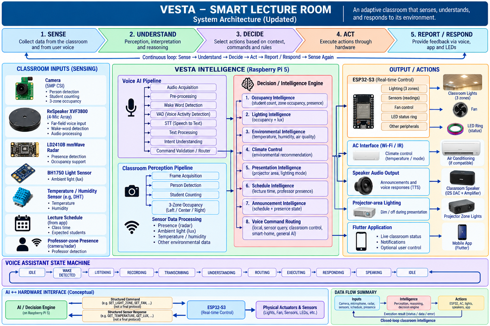

```markdown
# VESTA – AI Voice Assistant

### AI-powered voice interaction subsystem for the VESTA Smart Lecture Room

[](https://www.python.org/)
[](https://pytest.org/)
[](https://github.com/dscripka/openWakeWord)
[](https://www.raspberrypi.com/)

> **VESTA – Smart Lecture Room** is an adaptive classroom system designed to sense its environment, understand context and human commands, make decisions, execute actions through hardware, and provide feedback.
>
> This repository contains my **AI / Voice Assistant subsystem**, focusing on audio acquisition, audio processing, wake-word detection, evaluation infrastructure, and the interfaces required to connect voice interaction with the larger VESTA intelligence architecture.

---

## 🌐 Overview

Traditional classrooms often operate as relatively static environments where lighting, climate, presentation conditions, and interaction require manual control.

**VESTA** is designed as a closed-loop smart lecture-room system:

```text
SENSE
  ↓
UNDERSTAND
  ↓
DECIDE
  ↓
ACT
  ↓
REPORT / RESPOND
  ↓
SENSE AGAIN
```

The complete VESTA architecture combines:

- Classroom perception
- Voice interaction
- Contextual intelligence
- Decision-making
- Hardware control
- Application interaction
- Audio feedback

The larger system includes a **Raspberry Pi 5**, **ReSpeaker XVF3800**, camera, mmWave radar, ambient-light sensing, temperature/humidity sensing, **ESP32-S3**, classroom actuators, speaker output, and a Flutter application.

### Repository scope

This repository represents **one major subsystem** of VESTA.

It focuses specifically on the **AI / Voice Assistant subsystem** rather than the complete smart classroom implementation.

---

# 🏗️ System Architecture

The following diagram is the **authoritative VESTA system architecture** for this project.



The complete system is organized into five major stages:

| Stage | Role |
|---|---|
| **1. SENSE** | Collect information from the classroom and from user voice |
| **2. UNDERSTAND** | Perform perception, interpretation, and reasoning |
| **3. DECIDE** | Select actions based on context, commands, and rules |
| **4. ACT** | Execute actions through hardware |
| **5. REPORT / RESPOND** | Provide feedback through voice, the application, and LEDs |

This creates the intended closed-loop behaviour:

```text
Sense
  ↓
Understand
  ↓
Decide
  ↓
Act
  ↓
Report / Respond
  ↓
Sense Again
```

### Classroom Inputs

The architecture receives information from multiple classroom sources:

- **Camera**
  - Person detection
  - Student counting
  - Three-zone occupancy

- **ReSpeaker XVF3800**
  - Far-field voice input
  - Wake-word detection
  - Audio processing

- **LD2410B mmWave Radar**
  - Presence detection
  - Occupancy support

- **BH1750 Light Sensor**
  - Ambient light / lux

- **Temperature / Humidity Sensor**
  - Temperature
  - Humidity

- **Lecture Schedule**
  - Class time
  - Expected students

- **Professor-zone Presence**
  - Professor detection through camera/radar

---

## 🧠 VESTA Intelligence — Raspberry Pi 5

The Raspberry Pi 5 is the primary intelligence platform shown in the architecture.

It contains two major perception pathways:

### Voice AI Pipeline

```text
Audio Acquisition
        ↓
Pre-processing
        ↓
Wake Word Detection
        ↓
VAD
        ↓
STT
        ↓
Text Processing
        ↓
Intent Understanding
        ↓
Command Validation / Router
```

### Classroom Perception Pipeline

```text
Frame Acquisition
        ↓
Person Detection
        ↓
Student Counting
        ↓
3-Zone Occupancy
        ↓
Sensor Data Processing
```

Both pathways feed the **Decision / Intelligence Engine**.

---

## Decision / Intelligence Engine

The architecture defines eight intelligence functions:

1. **Occupancy Intelligence**
   - Student count
   - Zone occupancy
   - Presence

2. **Lighting Intelligence**
   - Occupancy + lux

3. **Environmental Intelligence**
   - Temperature
   - Humidity
   - Air quality

4. **Climate Control**
   - Environmental recommendations

5. **Presentation Intelligence**
   - Projector area
   - Lighting mode

6. **Schedule Intelligence**
   - Lecture time
   - Professor presence

7. **Announcement Intelligence**
   - Schedule + presence state

8. **Voice Command Routing**
   - Local commands
   - Sensor queries
   - Classroom control
   - Smart-home commands
   - General AI interaction

The Voice AI subsystem therefore acts as one input pathway into this larger intelligence layer.

---

# 🎙️ My Contribution — AI Voice Assistant

My main contribution to VESTA is the **AI / Voice Assistant subsystem**.

The purpose of this subsystem is to provide a natural voice interface through which a user can communicate with the VESTA intelligence layer.

The architecture defines the following voice pathway:

```text
ReSpeaker XVF3800
        ↓
Audio Acquisition
        ↓
Pre-processing
        ↓
Wake Word Detection
        ↓
VAD
        ↓
Speech-to-Text
        ↓
Text Processing
        ↓
Intent Understanding
        ↓
Command Validation / Router
        ↓
Decision / Intelligence Engine
        ↓
Hardware / Application Action
        ↓
Response / TTS
```

The important engineering boundary is:

```text
                 VOICE AI SUBSYSTEM
                        │
                        ▼
User Voice → Audio → Wake Word → Voice Processing
                        │
                        ▼
                 Structured Command
                        │
                        ▼
             VESTA Intelligence Layer
                        │
              ┌─────────┼─────────┐
              ▼         ▼         ▼
           ESP32-S3   Speaker   Flutter
              │
              ▼
       Physical Classroom
            Actions
```

The repository currently concentrates on the **audio and wake-word foundations**. The later VAD, STT, intent, routing, and end-to-end hardware stages are part of the broader architecture and development roadmap.

---

# 🎙️ Voice Assistant Pipeline

| Stage | Purpose | Output |
|---|---|---|
| **Audio Acquisition** | Acquire audio from the configured input source | PCM audio frames |
| **Pre-processing** | Prepare incoming audio for downstream processing | Processed audio frames |
| **Wake Word Detection** | Detect the assistant activation phrase | Detection event / score |
| **VAD** | Determine when meaningful speech is present | Speech boundaries |
| **STT** | Convert spoken language into text | Transcript |
| **Text Processing** | Normalize and prepare recognized text | Processed text |
| **Intent Understanding** | Interpret what the user wants to accomplish | Intent + entities |
| **Command Validation / Router** | Validate and route a structured command | Routed command |
| **Decision Engine** | Combine the command with classroom context | Selected action |
| **Action / Response** | Execute or communicate the result | Hardware action / response |

### Implementation boundary

The current repository provides the engineering foundation for:

- Audio acquisition
- Audio-source abstraction
- File-based audio input
- Audio reframing
- Wake-word detection
- OpenWakeWord integration
- Audio evaluation
- Automated testing

The following stages are represented in the overall architecture but remain **in development or planned integration** within this repository:

- VAD
- STT
- Text processing
- Intent understanding
- Command validation/routing
- TTS
- Complete voice-to-hardware execution

---

# 🔊 Audio Architecture

A key design decision is to separate **audio acquisition** from higher-level AI processing.

The repository contains separate components for microphone input and file-based audio input, allowing the same downstream processing architecture to work with either live or recorded audio.

Conceptually:

```text
                    Audio Source
                         │
             ┌───────────┴───────────┐
             │                       │
             ▼                       ▼
       Microphone Input         WAV File Input
             │                       │
             └───────────┬───────────┘
                         ▼
                    Audio Frames
                         │
                         ▼
                      Reframer
                         │
                         ▼
                 Wake Word Detector
```

This separation provides an engineering boundary between:

- Hardware-specific audio acquisition
- Audio representation
- Audio reframing
- AI inference
- Evaluation

It also makes recorded audio useful for repeatable software testing without requiring physical microphone hardware for every experiment.

---

# 🧩 Key Features

### Current software capabilities

- **Modular audio acquisition**
- **Microphone input support**
- **File-based WAV input**
- **Audio reframing**
- **Wake-word detector abstraction**
- **OpenWakeWord backend**
- **Audio analysis utilities**
- **Audio ingestion**
- **Resampling utilities**
- **Evaluation manifests**
- **Automated testing**
- **Configurable logging**
- **Hardware-independent recorded-audio testing**

### Architecture-level capabilities

The wider VESTA architecture additionally defines:

- Voice activity detection
- Speech-to-text
- Intent understanding
- Structured command routing
- Decision-engine integration
- ESP32-S3 hardware control
- TTS response
- Classroom-context reasoning

These should be distinguished from the software currently implemented in this repository.

---

# 🧠 Wake Word Detection

The wake-word subsystem uses a detector abstraction with an **OpenWakeWord** backend.

Conceptually:

```text
Audio Frame
     ↓
WakeWordDetector
     ↓
OpenWakeWord Backend
     ↓
Wake-word Score
     ↓
Detection Decision
     ↓
Wake Event
```

The abstraction keeps the higher-level audio pipeline independent of the specific wake-word engine.

This makes the backend replaceable while maintaining a stable interface for the rest of the system.

The repository does **not** claim custom wake-word model training.

Wake-word model files are treated as machine-local assets rather than source-code files.

---

# 🧪 Evaluation & Testing

Evaluation is treated as a dedicated engineering component of the project.

The repository contains infrastructure for:

- Audio ingestion
- Audio analysis
- Resampling
- Evaluation manifests
- Recorded-audio processing
- Wake-word evaluation
- Audio acquisition testing
- Reframing tests
- Detector testing
- Manifest validation

The evaluation architecture is intended to support future controlled experiments involving:

- Different speakers
- Different recording distances
- Quiet environments
- Background noise
- Wake-word thresholds
- False activations
- Missed detections
- Processing behaviour
- Raspberry Pi deployment

No accuracy, recall, F1, false-activation rate, or latency value is presented here unless it has been established through the corresponding controlled evaluation.

---

# 🧪 Testing Strategy

The project uses **pytest** for automated testing.

Testing is divided into focused modules so that individual components can be validated independently.

### Main testing areas

| Test Area | Purpose |
|---|---|
| **Audio acquisition** | Validate audio input behaviour |
| **File source** | Validate recorded WAV input |
| **Audio analysis** | Validate signal-analysis utilities |
| **Reframing** | Validate conversion into processing-sized audio blocks |
| **Resampling** | Validate audio sample-rate conversion |
| **Manifest handling** | Validate evaluation metadata |
| **Ingestion** | Validate evaluation-data ingestion |
| **Wake-word detector** | Validate the detector abstraction |
| **OpenWakeWord backend** | Validate the concrete wake-word integration |

The testing structure is designed to support incremental development rather than relying only on a final live demonstration.

---

# 🔌 Hardware Integration

The Voice AI subsystem is designed to connect the Raspberry Pi intelligence layer with the wider VESTA hardware ecosystem.

The architecture defines the following conceptual relationship:

```text
User Voice
    ↓
ReSpeaker XVF3800
    ↓
Raspberry Pi 5
    ↓
Voice AI
    ↓
Decision / Intelligence Engine
    ↓
Structured Command
    ↓
ESP32-S3
    ↓
Physical Actuators / Sensors
```

The larger architecture also contains:

### ESP32-S3

The ESP32-S3 is responsible for real-time hardware control in the VESTA system.

The architecture shows it interfacing with:

- Three-zone classroom lighting
- Sensor readings
- Fan control
- LED status ring
- Other peripherals

### AC Interface

The architecture includes an AC interface using Wi-Fi / IR for climate-control functionality where compatible.

### Speaker Audio Output

The speaker subsystem provides:

- Announcements
- Voice responses
- TTS output

### Projector-area Lighting

Dedicated projector-area lighting is included for presentation-related control.

### Flutter Application

The Flutter application provides:

- Live classroom status
- Notifications
- Optional user control

> The AI ↔ hardware interface shown in the architecture is explicitly a **conceptual interface**. This repository should not be interpreted as implementing the complete ESP32-S3, AC, speaker, lighting, or Flutter systems.

---

# 🔄 Voice Assistant State Machine

The VESTA architecture defines the following voice-assistant state machine:

```text
IDLE
  ↓
WAKE_DETECTED
  ↓
LISTENING
  ↓
RECORDING
  ↓
TRANSCRIBING
  ↓
UNDERSTANDING
  ↓
ROUTING
  ↓
EXECUTING
  ↓
RESPONDING
  ↓
SPEAKING
  ↓
IDLE
```

This state machine represents the intended end-to-end interaction lifecycle.

The presence of a state in the architecture does **not** imply that every state is already implemented in the current repository.

---

# 🔗 AI ↔ Hardware Interface

The architecture defines a conceptual bidirectional interface between the AI / Decision Engine and the ESP32-S3.

```text
        AI / Decision Engine
          (Raspberry Pi 5)
                  │
                  │ Structured Command
                  │
                  ▼
              ESP32-S3
          (Real-time Control)
                  │
                  ▼
      Physical Actuators & Sensors
```

The reverse direction returns sensor information and execution results:

```text
Physical Sensors
      ↓
ESP32-S3
      ↓
Sensor Response
      ↓
AI / Decision Engine
```

Example conceptual command categories shown in the architecture include:

- `SET_LIGHT_ZONE`
- `SET_FAN`
- Other actuator commands

Example conceptual sensor queries include:

- Temperature
- Lux
- Other environmental readings

These names describe the **architecture/interface concept**, not a finalized hardware communication protocol.

---

# 📁 Repository Structure

```text
VESTA-AI-Voice-Assistant/
│
├── audio/
│   ├── __init__.py
│   ├── base.py
│   ├── file_source.py
│   ├── microphone.py
│   └── reframer.py
│
├── config/
│   ├── __init__.py
│   ├── settings.py
│   └── logging_config.py
│
├── docs/
│   └── wp2_4_evaluation_protocol.md
│
├── evaluation/
│   ├── __init__.py
│   ├── audio_analysis.py
│   ├── ingest.py
│   ├── manifest.py
│   └── resample.py
│
├── tests/
│   ├── __init__.py
│   ├── conftest.py
│   ├── test_audio_acquisition.py
│   ├── test_audio_analysis.py
│   ├── test_file_source.py
│   ├── test_ingest.py
│   ├── test_manifest.py
│   ├── test_openwakeword_backend.py
│   ├── test_reframer.py
│   └── test_wakeword_detector.py
│
├── wakeword/
│   ├── __init__.py
│   ├── detector.py
│   └── openwakeword_backend.py
│
├── CLAUDE.md
├── WEEK2_REPORT.md
├── WEEK2_STATUS.md
├── record_demo.py
├── requirements.txt
└── .gitignore
```

### Directory responsibilities

| Directory | Purpose |
|---|---|
| `audio/` | Audio-source interfaces, microphone input, file input, and reframing |
| `config/` | Configuration and logging |
| `docs/` | Project and evaluation documentation |
| `evaluation/` | Audio analysis, ingestion, manifests, and resampling |
| `tests/` | Automated tests |
| `wakeword/` | Wake-word abstraction and OpenWakeWord backend |

---

# ⚙️ Technology Stack

## Voice AI Subsystem

| Technology | Role |
|---|---|
| **Python** | Core implementation language |
| **NumPy** | Numerical audio processing |
| **sounddevice** | Audio acquisition |
| **OpenWakeWord** | Wake-word detection |
| **ONNX Runtime** | ONNX inference backend |
| **pytest** | Automated testing |
| **WAV / PCM** | Recorded audio input and evaluation |

## Complete VESTA System

| Technology / Hardware | Role in VESTA |
|---|---|
| **Raspberry Pi 5** | Main intelligence platform |
| **ReSpeaker XVF3800** | Four-microphone voice input |
| **5MP CSI Camera** | Classroom visual perception |
| **LD2410B mmWave Radar** | Presence / occupancy sensing |
| **BH1750** | Ambient-light sensing |
| **Temperature / Humidity Sensor** | Environmental sensing |
| **ESP32-S3** | Real-time hardware control |
| **AC Interface** | Climate-control interface |
| **Speaker / Amplifier** | Audio output and announcements |
| **Projector-area Lighting** | Presentation lighting |
| **Flutter** | Classroom status and application interaction |

The second table represents the **larger VESTA architecture**, not functionality contained entirely within this repository.

---

# 🚀 Getting Started

## 1. Clone the repository

```bash
git clone https://github.com/hijab1514/VESTA-AI-Voice-Assistant.git
cd VESTA-AI-Voice-Assistant
```

## 2. Create a virtual environment

### Windows

```powershell
python -m venv .venv
.venv\Scripts\activate
```

### Linux / Raspberry Pi

```bash
python3 -m venv .venv
source .venv/bin/activate
```

## 3. Install dependencies

```bash
python -m pip install --upgrade pip
pip install -r requirements.txt
```

## 4. Run the test suite

```bash
python -m pytest -q -rs
```

Hardware-dependent tests may require the appropriate physical audio hardware.

---

# 💻 Usage

The repository contains `record_demo.py` as a recording/demo entry point.

The exact runtime configuration depends on the available audio device and project configuration.

For development, recorded WAV files can also be used as controlled audio input to test the processing and wake-word pipeline without requiring continuous live microphone capture.

The repository deliberately separates:

```text
Live Audio
    │
    ├── Microphone Source
    │
    └── Recorded WAV Source
              │
              ▼
       Common Processing
              │
              ▼
       Wake-word Backend
```

This enables the same downstream components to be exercised using controlled recordings.

---

# ⚙️ Configuration

Configuration is organized under:

```text
config/settings.py
```

Logging configuration is provided through:

```text
config/logging_config.py
```

Keeping configuration and logging separate from the core audio and wake-word implementation helps maintain a clean separation between runtime configuration and processing logic.

No credentials, API keys, private recordings, or machine-specific paths should be committed to the repository.

---

# 💡 Example Workflow

The following illustrates how a natural-language classroom command is intended to move through the complete VESTA architecture.

### Example

> **User:** "Turn on the classroom lights."

```text
User Voice
    ↓
ReSpeaker XVF3800
    ↓
Audio Acquisition
    ↓
Wake Word Detection
    ↓
VAD
    ↓
Speech-to-Text
    ↓
Text Processing
    ↓
Intent Understanding
    ↓
Command Validation / Router
    ↓
Decision / Intelligence Engine
    ↓
Structured Command
    ↓
ESP32-S3
    ↓
Classroom Lighting
    ↓
Execution Result
    ↓
Response / TTS
```

This is an **architectural example** showing the intended system flow. It is not a claim that the complete voice-to-lighting path is already implemented in this repository.

---

# 🔬 Engineering Design

The subsystem is designed around several engineering principles.

### Modularity

Audio acquisition, reframing, wake-word detection, configuration, evaluation, and testing are maintained as separate components.

### Separation of Concerns

Hardware-specific audio capture is separated from higher-level audio processing and wake-word inference.

### Hardware Abstraction

The audio pipeline can work with different sources, including microphone and file-based input, without requiring downstream components to know the details of the source.

### Testability

Individual modules have dedicated automated tests, while recorded audio provides a reproducible input path for evaluation.

### Replaceable AI Components

The wake-word detector is represented through an abstraction rather than coupling the entire pipeline directly to one inference implementation.

### Reproducibility

Recorded audio, manifests, ingestion tools, resampling utilities, and evaluation infrastructure provide a controlled basis for future experiments.

### Maintainability

The repository is divided into focused modules instead of combining acquisition, inference, configuration, and evaluation into one monolithic application.

### Future Extensibility

The architecture leaves defined boundaries for VAD, STT, intent understanding, command routing, decision-engine integration, and hardware control.

---

# 📊 Current Status

| Component | Status |
|---|---|
| Audio acquisition abstraction | **Implemented** |
| Microphone input | **Implemented** |
| File-based audio input | **Implemented** |
| Audio reframing | **Implemented** |
| Audio analysis utilities | **Implemented** |
| Resampling utilities | **Implemented** |
| Wake-word detector abstraction | **Implemented** |
| OpenWakeWord backend | **Implemented** |
| Evaluation / ingestion infrastructure | **Implemented** |
| Evaluation manifests | **Implemented** |
| Automated tests | **Implemented** |
| VAD | **In development / Planned** |
| STT | **Planned** |
| Text processing | **Planned** |
| Intent understanding | **Planned** |
| Command validation / routing | **Planned** |
| Decision-engine integration | **Planned integration** |
| ESP32-S3 integration | **Conceptual / Integration stage** |
| TTS response | **Planned** |
| Complete voice-to-hardware loop | **Planned** |
| Raspberry Pi + ReSpeaker validation | **Pending physical validation** |
| Classroom robustness evaluation | **Planned** |

---

# 📈 Development Roadmap

## ✅ Completed

- [x] Audio acquisition architecture
- [x] Microphone audio source
- [x] File-based audio source
- [x] Audio reframing
- [x] Audio analysis utilities
- [x] Resampling utilities
- [x] Wake-word detector abstraction
- [x] OpenWakeWord backend
- [x] Evaluation manifest infrastructure
- [x] Audio ingestion infrastructure
- [x] Automated testing infrastructure
- [x] Configuration and logging structure

## 🚧 In Progress

- [ ] Physical Raspberry Pi 5 validation
- [ ] ReSpeaker hardware validation
- [ ] Hardware/interface validation
- [ ] Real-world wake-word evaluation
- [ ] Integration with the wider VESTA system

## 🔮 Planned

- [ ] Voice Activity Detection
- [ ] Speech-to-Text integration
- [ ] Text processing
- [ ] Intent understanding
- [ ] Structured command schema
- [ ] Command validation
- [ ] Command routing
- [ ] Decision-engine integration
- [ ] ESP32-S3 integration
- [ ] End-to-end voice-to-hardware execution
- [ ] TTS response
- [ ] Noisy classroom robustness evaluation
- [ ] False wake-up evaluation
- [ ] End-to-end latency evaluation
- [ ] Multi-speaker evaluation
- [ ] Distance-based evaluation
- [ ] Complete VESTA system demonstration

---

# 🗺️ VESTA Data Flow

The architecture defines the overall data flow as:

```text
                    INPUTS
                      │
       Camera • Microphone • Radar
       Sensors • Schedule • Presence
                      │
                      ▼
              VESTA INTELLIGENCE
                      │
        Perception • Reasoning
        Decision / Intelligence
                      │
                      ▼
                  ACTIONS
                      │
        ESP32-S3 • AC • Lights
        Sensors • Speaker • App
                      │
                      ▼
               EXECUTION RESULT
                      │
                      ▼
             Feedback / Response
                      │
                      └───────────────┐
                                      │
                                      ▼
                               CLOSED LOOP
                               CLASSROOM
                               INTELLIGENCE
```

The Voice AI subsystem provides the **human voice input pathway** into this loop.

---

# 🎓 Final-Year Project

**Project:** VESTA – Smart Lecture Room

**Context:** Final-Year Computer Science Engineering Project

**University:** Sejong University, South Korea

**My Role:** AI / Voice Assistant Subsystem

The project combines:

- Artificial intelligence
- Voice interaction
- Computer vision
- Embedded systems
- Sensor fusion
- Hardware control
- Human-computer interaction
- Software engineering

---

# 👩‍💻 My Contribution

## AI / Voice Assistant Subsystem

My contribution focuses specifically on the **voice-interaction and AI processing layer** of the larger VESTA system.

Key areas of contribution include:

- Voice AI pipeline architecture
- Audio acquisition
- Microphone interface
- File-based audio input
- Audio processing
- Audio reframing
- Wake-word detection
- OpenWakeWord integration
- Evaluation infrastructure
- Audio ingestion
- Evaluation manifests
- Automated testing
- Voice-system integration interfaces

The architecture also defines future responsibilities around:

- VAD
- Speech-to-text
- Text processing
- Intent understanding
- Command validation
- Command routing
- Decision-engine integration
- TTS response

These later components are intentionally separated from the currently implemented audio and wake-word foundation.

### Contribution boundary

```text
┌──────────────────────────────────────────────┐
│              COMPLETE VESTA                  │
│                                              │
│  Classroom Sensing                           │
│  Computer Vision                             │
│  Voice AI                 ← MY SUBSYSTEM     │
│  Decision Intelligence                       │
│  ESP32-S3 Control                            │
│  Physical Actuators                          │
│  Flutter Application                         │
│  Speaker / Feedback                          │
│                                              │
└──────────────────────────────────────────────┘
```

The goal is not to claim ownership of the entire VESTA platform, but to develop a robust and well-engineered **Voice AI subsystem** that integrates cleanly with the rest of the system.

---

# 🔭 Future Vision

The long-term goal of VESTA is a classroom that can continuously **perceive its environment, understand human commands, reason about context, coordinate physical systems, and provide intelligent feedback** through a unified AI-driven architecture.

The desired interaction is therefore not simply:

```text
Command → Action
```

but:

```text
Environment
     ↓
Perception
     ↓
Understanding
     ↓
Contextual Reasoning
     ↓
Decision
     ↓
Action
     ↓
Feedback
     ↓
Continuous Sensing
```

Within this architecture, the Voice AI subsystem provides the natural-language interface through which humans can communicate with the intelligent classroom.

---

## 📄 License

No license has been specified for this repository at this stage.
```
