# VESTA – AI Voice Assistant

### AI-powered voice interaction subsystem for the VESTA Smart Lecture Room

[](https://www.python.org/)
[](https://pytest.org/)
[](https://github.com/dscripka/openWakeWord)
[](https://www.raspberrypi.com/)

> **VESTA – Smart Lecture Room** is an adaptive classroom system designed to sense its environment, understand context and human commands, make decisions, execute actions through hardware, and provide feedback.
>
> This repository contains my **AI / Voice Assistant subsystem** — the software foundation for audio acquisition, audio processing, wake-word detection, evaluation, and future voice-to-command integration.


## 🌐 Overview

Traditional classrooms often operate as relatively static environments where lighting, climate, presentation conditions, and interaction require manual control.

**VESTA** is designed as a closed-loop smart lecture-room system:

```text
SENSE
  ↓
UNDERSTAND
  ↓
DECIDE
  ↓
ACT
  ↓
REPORT / RESPOND
  ↓
SENSE AGAIN
```

The complete architecture combines:

- Classroom perception
- Voice interaction
- Contextual intelligence
- Decision-making
- Hardware control
- Application interaction
- Audio feedback

The wider VESTA system includes a **Raspberry Pi 5**, **ReSpeaker XVF3800**, camera, LD2410B mmWave radar, BH1750 light sensor, temperature/humidity sensing, **ESP32-S3**, classroom actuators, speaker output, projector-area lighting, and a Flutter application.

> **Repository scope:** this repository represents one major subsystem of VESTA. It does **not** claim to implement the complete smart classroom.

---

## 🏗️ System Architecture

The following image is the **authoritative VESTA system architecture** for this project.


The complete VESTA architecture is organized into five stages:

| Stage | Role |
|---|---|
| **1. SENSE** | Collect information from the classroom and from user voice |
| **2. UNDERSTAND** | Perform perception, interpretation, and reasoning |
| **3. DECIDE** | Select actions based on context, commands, and rules |
| **4. ACT** | Execute actions through hardware |
| **5. REPORT / RESPOND** | Provide feedback through voice, the application, and LEDs |

The intended system behaviour is:

**Sense → Understand → Decide → Act → Report / Respond → Sense Again**

### Classroom Inputs

The architecture receives information from:

- **Camera**
  - Person detection
  - Student counting
  - Three-zone occupancy

- **ReSpeaker XVF3800**
  - Far-field voice input
  - Wake-word detection
  - Audio processing

- **LD2410B mmWave Radar**
  - Presence detection
  - Occupancy support

- **BH1750 Light Sensor**
  - Ambient light / lux

- **Temperature / Humidity Sensor**
  - Temperature
  - Humidity

- **Lecture Schedule**
  - Class time
  - Expected students

- **Professor-zone Presence**
  - Professor detection through camera/radar

### VESTA Intelligence — Raspberry Pi 5

The Raspberry Pi 5 hosts the higher-level intelligence shown in the architecture, including:

- **Voice AI Pipeline**
- **Classroom Perception Pipeline**
- **Decision / Intelligence Engine**

The Decision / Intelligence Engine contains:

1. **Occupancy Intelligence**
2. **Lighting Intelligence**
3. **Environmental Intelligence**
4. **Climate Control**
5. **Presentation Intelligence**
6. **Schedule Intelligence**
7. **Announcement Intelligence**
8. **Voice Command Routing**

The Voice AI subsystem provides one major input pathway into this larger intelligence layer.

---

## 🎙️ My Contribution — AI Voice Assistant

My primary contribution to VESTA is the **AI / Voice Assistant subsystem**.

Its purpose is to provide a natural voice interface through which a user can communicate with the VESTA intelligence layer.

The architecture defines the following voice pathway:

```text
ReSpeaker XVF3800
        ↓
Audio Acquisition
        ↓
Pre-processing
        ↓
Wake Word Detection
        ↓
VAD
        ↓
Speech-to-Text
        ↓
Text Processing
        ↓
Intent Understanding
        ↓
Command Validation / Router
        ↓
Decision / Intelligence Engine
        ↓
Hardware / Application Action
        ↓
Response / TTS
```

The current repository concentrates on the **audio and wake-word foundations**.

VAD, STT, intent understanding, command routing, and complete hardware execution belong to the broader development roadmap.

### Voice AI Subsystem



```mermaid
flowchart LR
    A[ReSpeaker XVF3800] --> B[Audio Acquisition]
    B --> C[Pre-processing]
    C --> D[Wake Word Detection]
    D --> E[VAD]
    E --> F[Speech-to-Text]
    F --> G[Text Processing]
    G --> H[Intent Understanding]
    H --> I[Command Validation / Router]
    I --> J[VESTA Decision / Intelligence Engine]
    J --> K[Action / Response]
```

> This Mermaid diagram describes **only the Voice AI pathway**. The complete VESTA architecture is represented by the authoritative architecture image above.

---

## 🔊 Voice Interaction Pipeline

| Stage | Purpose | Output |
|---|---|---|
| **Audio Acquisition** | Acquire audio from the configured input source | PCM audio frames |
| **Pre-processing** | Prepare audio for downstream processing | Processed audio frames |
| **Wake Word Detection** | Detect the assistant activation phrase | Detection event / score |
| **Voice Activity Detection** | Identify meaningful speech activity | Speech boundaries |
| **Speech-to-Text** | Convert spoken language into text | Transcript |
| **Text Processing** | Normalize and prepare recognized text | Processed text |
| **Intent Understanding** | Interpret the user's intended action | Intent + entities |
| **Command Validation / Router** | Validate and route a structured command | Routed command |
| **Decision Engine** | Combine commands with classroom context | Selected action |
| **Response / TTS** | Communicate the result | Voice / application response |

### Current Implementation Boundary

The repository currently provides the foundation for:

- Audio acquisition
- Audio-source abstraction
- File-based WAV input
- Audio reframing
- Wake-word detection
- OpenWakeWord integration
- Audio analysis
- Audio ingestion
- Resampling
- Evaluation manifests
- Automated testing
- Configurable logging

The following stages are represented in the overall architecture but are not yet complete in this repository:

- VAD
- STT
- Text processing
- Intent understanding
- Command validation / routing
- Decision-engine integration
- TTS
- Complete voice-to-hardware execution

---

## 🧩 Key Features

### Implemented Software

- **Modular audio acquisition**
- **Microphone input implementation**
- **File-based WAV input**
- **Audio reframing**
- **Wake-word detector abstraction**
- **OpenWakeWord backend**
- **Audio analysis utilities**
- **Audio ingestion**
- **Resampling utilities**
- **Evaluation manifests**
- **Automated testing**
- **Structured logging**
- **Recorded-audio testing**

### Architecture-Level Capabilities

The wider VESTA architecture defines additional capabilities including:

- Voice activity detection
- Speech-to-text
- Intent understanding
- Structured command routing
- Decision-engine integration
- ESP32-S3 hardware control
- TTS response
- Classroom-context reasoning

These should not be confused with functionality currently implemented in this repository.

---

## 🧠 Wake Word Detection

The wake-word subsystem uses a detector abstraction with an **OpenWakeWord** backend.

```text
Audio Frame
     ↓
WakeWordDetector
     ↓
OpenWakeWord Backend
     ↓
Wake-word Score
     ↓
Detection Decision
     ↓
Wake Event
```

The abstraction keeps higher-level processing independent of the specific wake-word engine.

This creates a replaceable boundary between:

```text
Audio Input
     ↓
Detector Interface
     ↓
Wake-word Backend
```

Wake-word model files are treated as machine-local assets rather than source-code files.

---

## 🧪 Evaluation & Testing

Evaluation is treated as a dedicated engineering component rather than only a final demonstration.

The repository contains infrastructure for:

- Audio ingestion
- Audio analysis
- Resampling
- Evaluation manifests
- Recorded-audio processing
- Wake-word evaluation
- Audio acquisition testing
- File-source testing
- Reframing tests
- Detector testing
- Manifest validation

The evaluation structure is intended to support controlled experiments involving:

- Different speakers
- Different recording distances
- Quiet environments
- Background noise
- Wake-word thresholds
- False activations
- Missed detections
- Processing behaviour
- Raspberry Pi deployment

> No accuracy, recall, F1, false-activation rate, or latency value is presented here unless established through the corresponding controlled evaluation.

### Testing Strategy

The project uses **pytest** for automated testing.

| Test Area | Purpose |
|---|---|
| Audio acquisition | Validate audio-input behaviour |
| File source | Validate recorded WAV input |
| Audio analysis | Validate signal-analysis utilities |
| Reframing | Validate processing-sized audio blocks |
| Resampling | Validate sample-rate conversion |
| Manifest handling | Validate evaluation metadata |
| Ingestion | Validate evaluation-data ingestion |
| Wake-word detector | Validate detector abstraction |
| OpenWakeWord backend | Validate concrete wake-word integration |

The testing structure supports incremental development rather than relying only on a final live demonstration.

---

## 🔌 Hardware Integration

The Voice AI subsystem is designed to connect the Raspberry Pi intelligence layer with the wider VESTA hardware ecosystem.

```text
User Voice
    ↓
ReSpeaker XVF3800
    ↓
Raspberry Pi 5
    ↓
Voice AI
    ↓
Decision / Intelligence Engine
    ↓
Structured Command
    ↓
ESP32-S3
    ↓
Physical Actuators / Sensors
```

### ESP32-S3

The architecture assigns the **ESP32-S3** to real-time hardware control, including interfaces for:

- Three-zone classroom lighting
- Sensor readings
- Fan control
- LED status ring
- Other peripherals

### AC Interface

The architecture includes an **AC Interface using Wi-Fi / IR** for climate-control functionality where compatible.

### Speaker Audio Output

The speaker subsystem provides:

- Announcements
- Voice responses
- TTS output

### Projector-area Lighting

Dedicated projector-area lighting is included for presentation-related control.

### Flutter Application

The Flutter application provides:

- Live classroom status
- Notifications
- Optional user control

> The AI ↔ hardware interface shown in the architecture is a **conceptual interface**. This repository does not claim to implement the complete ESP32-S3, AC, speaker, lighting, or Flutter systems.

---

## 🔄 Voice Assistant State Machine

The architecture defines the following intended interaction lifecycle:

```text
IDLE
  ↓
WAKE_DETECTED
  ↓
LISTENING
  ↓
RECORDING
  ↓
TRANSCRIBING
  ↓
UNDERSTANDING
  ↓
ROUTING
  ↓
EXECUTING
  ↓
RESPONDING
  ↓
SPEAKING
  ↓
IDLE
```

The state machine represents the **intended end-to-end architecture**.

A state appearing in this diagram does not imply that every state is already implemented in this repository.

---

## 🔗 AI ↔ Hardware Interface

The architecture defines a conceptual bidirectional interface between the AI / Decision Engine and the ESP32-S3.

```text
AI / Decision Engine
      │
      │ Structured Command
      ▼
   ESP32-S3
      │
      ▼
Physical Actuators & Sensors
```

Sensor information and execution results return through the reverse path:

```text
Physical Sensors
      ↓
   ESP32-S3
      ↓
Sensor Response
      ↓
AI / Decision Engine
```

Conceptual command categories include:

- `SET_LIGHT_ZONE`
- `SET_FAN`
- Other actuator commands

Conceptual sensor queries include:

- Temperature
- Lux
- Other environmental readings

These names describe the **architecture/interface concept**, not a finalized hardware communication protocol.

---

## 📁 Repository Structure

```text
VESTA-AI-Voice-Assistant/
│
├── audio/
│   ├── __init__.py
│   ├── base.py
│   ├── file_source.py
│   ├── microphone.py
│   └── reframer.py
│
├── config/
│   ├── __init__.py
│   ├── settings.py
│   └── logging_config.py
│
├── docs/
│   └── wp2_4_evaluation_protocol.md
│
├── evaluation/
│   ├── __init__.py
│   ├── audio_analysis.py
│   ├── ingest.py
│   ├── manifest.py
│   └── resample.py
│
├── tests/
│   ├── __init__.py
│   ├── conftest.py
│   ├── test_audio_acquisition.py
│   ├── test_audio_analysis.py
│   ├── test_file_source.py
│   ├── test_ingest.py
│   ├── test_manifest.py
│   ├── test_openwakeword_backend.py
│   ├── test_reframer.py
│   └── test_wakeword_detector.py
│
├── wakeword/
│   ├── __init__.py
│   ├── detector.py
│   └── openwakeword_backend.py
│
├── CLAUDE.md
├── WEEK2_REPORT.md
├── WEEK2_STATUS.md
├── record_demo.py
├── requirements.txt
└── .gitignore
```

| Directory | Purpose |
|---|---|
| `audio/` | Audio-source interfaces, microphone input, file input, and reframing |
| `config/` | Runtime configuration and logging |
| `docs/` | Project and evaluation documentation |
| `evaluation/` | Audio analysis, ingestion, manifests, and resampling |
| `tests/` | Automated tests |
| `wakeword/` | Wake-word abstraction and OpenWakeWord backend |

---

## ⚙️ Technology Stack

### Voice AI Subsystem

| Technology | Role |
|---|---|
| **Python** | Core implementation language |
| **NumPy** | Numerical audio processing |
| **sounddevice** | Audio acquisition |
| **OpenWakeWord** | Wake-word detection |
| **ONNX Runtime** | ONNX inference backend |
| **pytest** | Automated testing |
| **WAV / PCM** | Recorded audio input and evaluation |

### Complete VESTA System

| Technology / Hardware | Role |
|---|---|
| **Raspberry Pi 5** | Main intelligence platform |
| **ReSpeaker XVF3800** | Four-microphone voice input |
| **5MP CSI Camera** | Classroom visual perception |
| **LD2410B mmWave Radar** | Presence / occupancy sensing |
| **BH1750** | Ambient-light sensing |
| **Temperature / Humidity Sensor** | Environmental sensing |
| **ESP32-S3** | Real-time hardware control |
| **AC Interface** | Climate-control interface |
| **Speaker / Amplifier** | Audio output and announcements |
| **Projector-area Lighting** | Presentation lighting |
| **Flutter** | Classroom status and application interaction |

> The second table represents the **larger VESTA architecture**, not functionality contained entirely within this repository.

---

## 🚀 Getting Started

### 1. Clone the repository

```bash
git clone https://github.com/hijab1514/VESTA-AI-Voice-Assistant.git
cd VESTA-AI-Voice-Assistant
```

### 2. Create a virtual environment

#### Windows

```powershell
python -m venv .venv
.venv\Scripts\activate
```

#### Linux / Raspberry Pi

```bash
python3 -m venv .venv
source .venv/bin/activate
```

### 3. Install dependencies

```bash
python -m pip install --upgrade pip
pip install -r requirements.txt
```

### 4. Run the test suite

```bash
python -m pytest -q -rs
```

Hardware-dependent tests may require the appropriate physical audio hardware.

### 5. Recording / Development Demo

The repository contains `record_demo.py` as a recording/demo entry point.

Recorded WAV files can also be used as controlled inputs for development and wake-word evaluation.

---

## 💻 Example Workflow

The following illustrates the intended architecture for a natural-language classroom command.

> **User:** “Turn on the classroom lights.”

```text
User Voice
    ↓
ReSpeaker XVF3800
    ↓
Audio Acquisition
    ↓
Wake Word Detection
    ↓
VAD
    ↓
Speech-to-Text
    ↓
Text Processing
    ↓
Intent Understanding
    ↓
Command Validation / Router
    ↓
Decision / Intelligence Engine
    ↓
Structured Command
    ↓
ESP32-S3
    ↓
Classroom Lighting
    ↓
Execution Result
    ↓
Response / TTS
```

> This is an **architectural example**, not a claim that the complete voice-to-lighting path is already implemented.

---

## 🔬 Engineering Design

The subsystem is built around several engineering principles.

### Modularity

Audio acquisition, reframing, wake-word detection, configuration, evaluation, and testing are separated into focused components.

### Separation of Concerns

Hardware-specific audio capture is separated from audio processing, inference, configuration, and evaluation.

### Hardware Abstraction

Downstream processing depends on audio interfaces rather than being tightly coupled to a particular physical capture implementation.

### Testability

Individual components have dedicated automated tests, while recorded audio provides a reproducible input path for software evaluation.

### Replaceable AI Components

Wake-word processing is exposed through an abstraction so the inference backend can be changed without redesigning the surrounding pipeline.

### Reproducibility

Recorded inputs, manifests, ingestion tools, resampling utilities, and automated tests provide a controlled basis for future experiments.

### Maintainability

The repository keeps acquisition, inference, configuration, and evaluation in separate modules instead of combining them into a monolithic application.

### Future Extensibility

Defined interfaces leave room for VAD, STT, intent understanding, command routing, decision-engine integration, and hardware control.

---

## 📊 Current Status

| Component | Status |
|---|---|
| Audio acquisition abstraction | **Implemented** |
| Microphone input implementation | **Implemented** |
| File-based audio input | **Implemented** |
| Audio reframing | **Implemented** |
| Audio analysis utilities | **Implemented** |
| Resampling utilities | **Implemented** |
| Wake-word detector abstraction | **Implemented** |
| OpenWakeWord backend | **Implemented** |
| Evaluation / ingestion infrastructure | **Implemented** |
| Evaluation manifests | **Implemented** |
| Automated tests | **Implemented** |
| VAD | **Planned** |
| STT | **Planned** |
| Text processing | **Planned** |
| Intent understanding | **Planned** |
| Command validation / routing | **Planned** |
| Decision-engine integration | **Planned integration** |
| ESP32-S3 integration | **Planned integration** |
| TTS response | **Planned** |
| Complete voice-to-hardware loop | **Planned** |
| Raspberry Pi + ReSpeaker validation | **Pending physical validation** |
| Classroom robustness evaluation | **Planned** |

---

## 📈 Development Roadmap

### ✅ Completed

- [x] Audio acquisition architecture
- [x] Microphone audio-source implementation
- [x] File-based audio source
- [x] Audio reframing
- [x] Audio analysis utilities
- [x] Resampling utilities
- [x] Wake-word detector abstraction
- [x] OpenWakeWord backend
- [x] Evaluation manifest infrastructure
- [x] Audio ingestion infrastructure
- [x] Automated testing infrastructure
- [x] Configuration and logging structure

### 🚧 In Progress

- [ ] Physical Raspberry Pi 5 validation
- [ ] ReSpeaker hardware validation
- [ ] Hardware/interface validation
- [ ] Real-world wake-word evaluation
- [ ] Integration with the wider VESTA system

### 🔮 Planned

- [ ] Voice Activity Detection
- [ ] Speech-to-Text integration
- [ ] Text processing
- [ ] Intent understanding
- [ ] Structured command schema
- [ ] Command validation
- [ ] Command routing
- [ ] Decision-engine integration
- [ ] ESP32-S3 integration
- [ ] End-to-end voice-to-hardware execution
- [ ] TTS response
- [ ] Noisy classroom robustness evaluation
- [ ] False wake-up evaluation
- [ ] End-to-end latency evaluation
- [ ] Multi-speaker evaluation
- [ ] Distance-based evaluation
- [ ] Complete VESTA system demonstration

---

## 🗺️ VESTA Data Flow

The architecture defines the overall classroom data flow as:

```text
INPUTS
  │
  ├── Camera
  ├── Microphone
  ├── Radar
  ├── Environmental Sensors
  ├── Schedule
  └── Presence
       │
       ▼
VESTA INTELLIGENCE
  │
  ├── Perception
  ├── Interpretation
  ├── Reasoning
  └── Decision / Intelligence
       │
       ▼
ACTIONS
  │
  ├── ESP32-S3
  ├── AC Interface
  ├── Lighting
  ├── Speaker
  └── Flutter Application
       │
       ▼
EXECUTION RESULT
       │
       ▼
FEEDBACK / RESPONSE
       │
       └───────────────→ CLOSED-LOOP CLASSROOM INTELLIGENCE
```

The Voice AI subsystem provides the **human voice input pathway** into this loop.

---

## 🎓 Final-Year Project

**Project:** VESTA – Smart Lecture Room

**Context:** Final-Year Computer Science Engineering Project

**University:** Sejong University, South Korea

**My Role:** AI / Voice Assistant Subsystem

The wider project combines:

- Artificial intelligence
- Voice interaction
- Computer vision
- Embedded systems
- Sensor fusion
- Hardware control
- Human-computer interaction
- Software engineering

---

## 👩‍💻 My Contribution

My contribution focuses specifically on the **voice-interaction and AI processing layer** of the larger VESTA system.

Key areas include:

- Voice AI pipeline architecture
- Audio acquisition
- Microphone interface
- File-based audio input
- Audio processing
- Audio reframing
- Wake-word detection
- OpenWakeWord integration
- Evaluation infrastructure
- Audio ingestion
- Evaluation manifests
- Automated testing
- Voice-system integration interfaces

The broader architecture also defines future work around:

- VAD
- Speech-to-text
- Text processing
- Intent understanding
- Command validation
- Command routing
- Decision-engine integration
- TTS response

These later components are intentionally separated from the currently implemented audio and wake-word foundation.

### Contribution Boundary

```text
┌──────────────────────────────────────────────┐
│                 COMPLETE VESTA               │
│                                              │
│  Classroom Sensing                           │
│  Computer Vision                             │
│  Voice AI                 ← MY SUBSYSTEM     │
│  Decision Intelligence                       │
│  ESP32-S3 Control                            │
│  Physical Actuators                          │
│  Flutter Application                         │
│  Speaker / Feedback                          │
│                                              │
└──────────────────────────────────────────────┘
```

The goal is not to claim ownership of the entire VESTA platform, but to develop a robust and well-engineered **Voice AI subsystem** that integrates cleanly with the rest of the system.

---

## 🔭 Future Vision

The long-term goal of VESTA is a classroom that can continuously **perceive its environment, understand human commands, reason about context, coordinate physical systems, and provide intelligent feedback** through a unified AI-driven architecture.

The desired interaction is therefore not simply:

```text
Command → Action
```

but:

```text
Environment
    ↓
Perception
    ↓
Understanding
    ↓
Contextual Reasoning
    ↓
Decision
    ↓
Action
    ↓
Feedback
    ↓
Continuous Sensing
```

Within this architecture, the Voice AI subsystem provides the natural-language interface through which humans can communicate with the intelligent classroom.

---

## 📄 License

No license has been specified for this repository at this stage.
```
