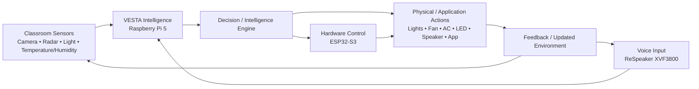
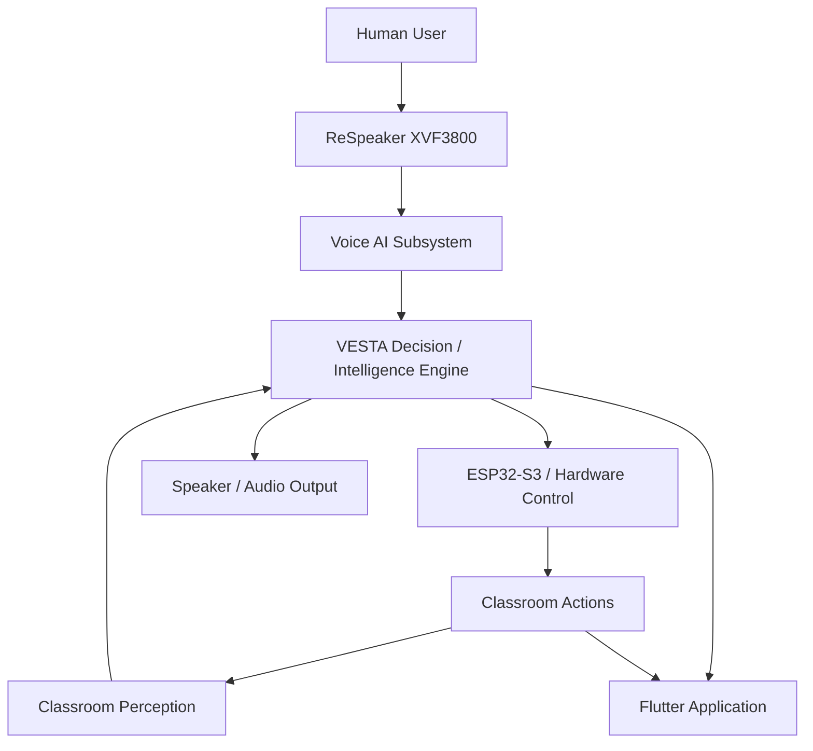

```markdown
# VESTA – AI Voice Assistant

### AI-driven voice interaction subsystem for the VESTA Smart Lecture Room

[](https://www.python.org/)
[](https://pytest.org/)
[](https://github.com/dscripka/openWakeWord)
[](https://www.raspberrypi.com/)
[](#current-status)

> **VESTA – Smart Lecture Room** is an adaptive classroom system designed to sense its environment, understand context and human commands, make decisions, control physical systems, and provide feedback.
>
> This repository contains my **AI / Voice Assistant subsystem**, focused on the engineering foundations for microphone acquisition, audio processing, wake-word detection, and evaluation.

---

## 🌐 Overview

Traditional classrooms largely operate as static environments. Lighting, climate, presentation conditions, and user interaction often require manual control.

**VESTA** aims to create a classroom that can continuously perceive its environment and respond intelligently:

```text
Sense
  ↓
Understand
  ↓
Decide
  ↓
Act
  ↓
Report / Respond
  ↓
Sense Again
```

The complete VESTA ecosystem combines:

- Classroom perception
- Voice interaction
- Contextual intelligence
- Decision-making
- Physical hardware control
- Application-level interaction
- Audio feedback

The larger system is built around hardware and software such as:

- Raspberry Pi 5
- ReSpeaker XVF3800 microphone array
- Camera
- LD2410B mmWave radar
- BH1750 ambient light sensor
- Temperature / humidity sensing
- ESP32-S3
- Classroom lighting
- Fan and AC control
- LED status indicators
- Speaker / audio output
- Flutter application

### Repository Scope

This repository does **not** represent the entire VESTA system.

It focuses specifically on the **AI / Voice Assistant subsystem** and its supporting evaluation infrastructure.

---

# 🧠 System Architecture

At the system level, VESTA follows a closed-loop architecture in which environmental and human inputs are interpreted by the intelligence layer and converted into physical or application-level actions.



The Voice AI subsystem acts as one of the primary human-interaction paths into the VESTA intelligence layer.

---

# 🎙️ My Contribution — AI Voice Assistant

My main contribution is the **AI / Voice Assistant subsystem**.

The subsystem is designed to transform spoken commands into structured information that can eventually be consumed by the VESTA decision and hardware-control layers.

### Voice pipeline

```text
ReSpeaker XVF3800
        ↓
Audio Acquisition
        ↓
Audio Pre-processing
        ↓
Wake Word Detection
        ↓
Voice Activity Detection
        ↓
Speech-to-Text
        ↓
Text Processing
        ↓
Intent Understanding
        ↓
Command Validation / Routing
        ↓
VESTA Decision Engine
        ↓
Hardware / Application Action
        ↓
Response / TTS
```

The important engineering boundary is:

```text
                 THIS REPOSITORY
                       │
                       ▼
Microphone → Audio → Wake Word → Future Voice AI Stages
                       │
                       ▼
              Structured Command
                       │
                       ▼
              VESTA Intelligence
                       │
              ┌────────┴────────┐
              ▼                 ▼
          ESP32-S3          Application
              │
              ▼
      Physical Classroom
           Actions
```

The repository currently concentrates on the **audio and wake-word foundations**. Later stages such as VAD, STT, intent understanding, command routing, and end-to-end hardware control remain part of the broader architecture and development roadmap.

---

# 🔊 Voice Interaction Pipeline

| Stage | Purpose | Current Output / Boundary |
|---|---|---|
| **Audio Acquisition** | Obtain PCM audio from the configured input source | Audio frames |
| **Audio Pre-processing** | Prepare audio into predictable blocks suitable for downstream processing | Reframed / processed audio |
| **Wake Word Detection** | Determine whether the assistant activation phrase has been detected | Detection event + score |
| **Voice Activity Detection** | Identify the beginning and end of spoken activity | Speech segments |
| **Speech-to-Text** | Convert spoken language into text | Transcript |
| **Text Processing** | Normalize and prepare recognized text | Processed text |
| **Intent Understanding** | Determine what the user wants VESTA to do | Intent + entities |
| **Command Validation / Routing** | Validate a command and route it to the appropriate subsystem | Structured command |
| **Response / TTS** | Convert execution results into an appropriate user response | Spoken response |

### Implementation boundary

The first three stages are the current focus of this repository:

- Audio acquisition
- Audio processing / reframing
- Wake-word detection

The remaining stages are integration targets for the complete VESTA voice pipeline.

---

# 🏗️ Audio Architecture

A central design principle is to separate **hardware-specific audio acquisition** from higher-level AI processing.

The repository defines an `AudioSource` abstraction so downstream components do not need to depend directly on a particular microphone backend.

Conceptually:

```text
                 AudioSource
                     │
          ┌──────────┴──────────┐
          │                     │
          ▼                     ▼
 ReSpeakerMicrophone       WavFileSource
          │                     │
          └──────────┬──────────┘
                     ▼
                Audio Frames
                     │
                     ▼
                  Reframer
                     │
                     ▼
             Wake Word Detector
```

This allows the same processing path to work with:

- Physical microphone input
- Recorded WAV files
- Test-generated audio

The architecture therefore supports development and evaluation without requiring physical hardware for every software test.

### Why this matters

The separation provides:

- **Hardware abstraction** — higher-level modules do not need to know how the microphone is accessed.
- **Testability** — recorded audio can be replayed through the same processing path.
- **Modularity** — audio acquisition and AI processing remain separate responsibilities.
- **Replaceability** — the capture backend can be changed without redesigning downstream consumers.
- **Reproducibility** — recorded audio can be processed repeatedly under controlled conditions.

---

# 🎧 Wake Word Detection

The wake-word layer is implemented around a backend-independent detector abstraction.

The current backend uses **openWakeWord**.

```text
Audio Frame
     │
     ▼
WakeWordDetector
     │
     ▼
OpenWakeWord Backend
     │
     ▼
Wake-word score
     │
     ▼
Threshold / Detection Decision
     │
     ▼
Detection Event
```

The design intentionally separates the generic detection logic from the specific wake-word engine.

This makes it possible to evaluate or replace the wake-word backend without changing the rest of the audio pipeline.

The repository also keeps wake-word model assets separate from source control rather than embedding model files directly into the project repository.

> Wake-word evaluation infrastructure is present, but a statistically meaningful accuracy or false-activation benchmark requires a larger labelled evaluation corpus and physical deployment testing.

---

# 🧪 Evaluation & Testing

Evaluation is treated as an engineering component rather than only a final demonstration.

The repository contains infrastructure for:

- Audio ingestion
- Audio analysis
- Resampling
- Evaluation manifests
- File-based audio replay
- Wake-word evaluation
- Audio acquisition testing
- Reframing tests
- Detector tests
- Manifest validation
- Test fixtures

The evaluation design allows recorded audio to be processed independently from live microphone acquisition.

This provides a controlled path for future experiments involving:

- Wake-word detection rate
- Missed detections
- False activations
- Different recording conditions
- Different speakers
- Background noise
- Distance from the microphone
- Threshold selection
- Processing latency

### Important evaluation boundary

The current repository provides the **evaluation infrastructure**, but this README does not present unverified accuracy, F1, recall, false-activation, CPU, or latency values as project results.

Those metrics require controlled experiments on an appropriately labelled dataset and, ultimately, validation on the target Raspberry Pi hardware.

---

# 🧩 Testing Strategy

The project uses **pytest** for automated testing.

Tests are organized around individual engineering components rather than one large end-to-end script.

### Main test areas

| Area | Purpose |
|---|---|
| Audio acquisition | Validate microphone interface behaviour and device handling |
| File source | Validate WAV-based audio input |
| Audio analysis | Validate signal-analysis utilities |
| Reframing | Verify audio blocks are produced correctly |
| Resampling | Validate sample-rate conversion utilities |
| Manifest handling | Validate evaluation metadata |
| Ingestion | Validate controlled audio-data ingestion |
| Wake-word detector | Validate detector abstraction and behaviour |
| OpenWakeWord backend | Validate the concrete wake-word integration |

This structure keeps failures localized and makes individual modules easier to develop and replace.

---

# 🔌 Hardware Integration

The voice subsystem is designed to operate as one part of the larger VESTA hardware/software ecosystem.

### Conceptual integration

```text
                 User Voice
                     │
                     ▼
             ReSpeaker XVF3800
                     │
                     ▼
                Raspberry Pi 5
                     │
                     ▼
                Voice AI
                     │
                     ▼
            Structured Command
                     │
                     ▼
          VESTA Decision Engine
                     │
                     ▼
                 ESP32-S3
                     │
          ┌──────────┼──────────┐
          ▼          ▼          ▼
       Lighting     Fan       AC / LED
          │
          └──────────┬──────────┘
                     ▼
             Classroom State
                     │
                     ▼
                  Feedback
```

### Responsibility boundary

**Raspberry Pi 5**

Responsible for higher-level intelligence and AI processing, including the voice subsystem.

**ESP32-S3**

Responsible for the lower-level hardware/control layer in the larger VESTA architecture.

**Physical classroom hardware**

Includes lighting, environmental controls, indicators, and other actuators.

This repository does not claim to implement the complete ESP32-S3 control system. The hardware-control connection is an integration boundary for the larger VESTA project.

---

# 📁 Repository Structure

```text
VESTA-AI-Voice-Assistant/
│
├── audio/
│   ├── __init__.py
│   ├── base.py
│   ├── file_source.py
│   ├── microphone.py
│   └── reframer.py
│
├── config/
│   ├── __init__.py
│   ├── settings.py
│   └── logging_config.py
│
├── docs/
│   └── wp2_4_evaluation_protocol.md
│
├── evaluation/
│   ├── __init__.py
│   ├── audio_analysis.py
│   ├── ingest.py
│   ├── manifest.py
│   └── resample.py
│
├── tests/
│   ├── __init__.py
│   ├── conftest.py
│   ├── test_audio_acquisition.py
│   ├── test_audio_analysis.py
│   ├── test_file_source.py
│   ├── test_ingest.py
│   ├── test_manifest.py
│   ├── test_openwakeword_backend.py
│   ├── test_reframer.py
│   └── test_wakeword_detector.py
│
├── wakeword/
│   ├── __init__.py
│   ├── detector.py
│   └── openwakeword_backend.py
│
├── CLAUDE.md
├── WEEK2_REPORT.md
├── WEEK2_STATUS.md
├── record_demo.py
├── requirements.txt
└── .gitignore
```

### Directory responsibilities

| Directory | Purpose |
|---|---|
| `audio/` | Audio-source abstractions, microphone capture, WAV input, and reframing |
| `config/` | Audio configuration and structured logging |
| `docs/` | Evaluation and engineering documentation |
| `evaluation/` | Audio analysis, ingestion, manifests, and resampling |
| `tests/` | Automated unit and integration-oriented tests |
| `wakeword/` | Wake-word abstraction and OpenWakeWord backend |

---

# ⚙️ Technology Stack

## Voice AI Subsystem

| Technology | Role |
|---|---|
| **Python** | Core implementation language |
| **NumPy** | Numerical audio representation and processing |
| **sounddevice / PortAudio** | Microphone audio acquisition |
| **openWakeWord** | Wake-word detection backend |
| **ONNX Runtime** | ONNX inference backend |
| **pytest** | Automated testing |
| **WAV / PCM audio** | Reproducible recorded-audio input |

## Larger VESTA System

| Technology / Hardware | Role |
|---|---|
| **Raspberry Pi 5** | Main computing platform for VESTA intelligence |
| **ReSpeaker XVF3800** | Four-microphone audio input |
| **Camera** | Classroom visual perception |
| **LD2410B** | Presence / motion sensing |
| **BH1750** | Ambient-light sensing |
| **Temperature / humidity sensor** | Environmental sensing |
| **ESP32-S3** | Hardware control layer |
| **Classroom actuators** | Lighting, fan, AC and status control |
| **Flutter** | Application interface |

The second table describes the **larger VESTA architecture**; these components are not all implemented in this repository.

---

# 🚀 Getting Started

## 1. Clone the repository

```bash
git clone https://github.com/hijab1514/VESTA-AI-Voice-Assistant.git
cd VESTA-AI-Voice-Assistant
```

## 2. Create a virtual environment

### Windows

```powershell
python -m venv .venv
.venv\Scripts\activate
```

### Linux / Raspberry Pi

```bash
python3 -m venv .venv
source .venv/bin/activate
```

## 3. Install Python dependencies

```bash
python -m pip install --upgrade pip
pip install -r requirements.txt
```

On Linux/Raspberry Pi, the audio backend may also require the appropriate PortAudio system library.

## 4. Run the automated tests

```bash
python -m pytest -q -rs
```

The hardware-dependent tests are designed to distinguish software failures from tests that require the physical ReSpeaker device.

## 5. Run the recording demo

The repository includes a simple recording entry point:

```bash
python record_demo.py
```

A duration and output filename can also be supplied:

```bash
python record_demo.py 10 my_test.wav
```

The recording path requires an available compatible audio input device.

---

# ▶️ Wake-Word Usage

The wake-word backend can also operate on recorded WAV input.

Conceptually:

```text
WAV file
   ↓
WavFileSource
   ↓
Reframer
   ↓
OpenWakeWordDetector
   ↓
Detection events
```

A recorded clip can be evaluated through the wake-word backend when the required model assets are available.

The project intentionally keeps downloaded model files outside source control.

---

# ⚙️ Configuration

Audio configuration is centralized under:

```text
config/settings.py
```

This keeps audio-related parameters separate from implementation logic.

The configuration layer is responsible for values such as the audio input configuration and buffering behaviour used by the acquisition module.

Structured logging is provided through:

```text
config/logging_config.py
```

This gives the audio subsystem a consistent mechanism for recording events such as device discovery, stream startup, errors, and timing information.

No credentials or private configuration should be committed to the repository.

---

# 💡 Example Workflow

The following illustrates the intended VESTA interaction path.

> **User:**  
> "Turn on the classroom lights."

```text
Voice Input
     ↓
Wake Word Detection
     ↓
Speech Recognition
     ↓
Text Processing
     ↓
Intent Understanding
     ↓
Command Validation
     ↓
Command Router
     ↓
VESTA Decision Engine
     ↓
ESP32-S3
     ↓
Classroom Lighting
```

This is an **architectural example**, not a claim that the complete command-to-lighting path is already implemented in this repository.

---

# 🔬 Engineering Design Decisions

The subsystem is designed around several engineering principles.

### 1. Separation of concerns

Microphone acquisition, audio processing, wake-word detection, and evaluation are kept as separate components.

### 2. Hardware abstraction

Higher-level processing depends on audio interfaces rather than directly depending on a particular microphone implementation.

### 3. Replaceable AI components

The wake-word layer uses an abstraction so that a different detector backend can be introduced without redesigning the entire audio pipeline.

### 4. File-based reproducibility

Recorded audio can be processed independently of live hardware, allowing controlled software experiments.

### 5. Testability

Individual components have dedicated automated tests instead of relying only on a final live demonstration.

### 6. Configuration isolation

Device and audio settings are centralized rather than scattered through implementation code.

### 7. Evaluation-first development

Evaluation infrastructure is developed alongside the software so that future performance claims can be supported by reproducible experiments rather than subjective demonstrations.

### 8. Integration boundaries

The Voice AI subsystem produces information that can eventually be consumed by the VESTA decision layer without directly owning the complete hardware-control system.

---

# 📈 Current Status

| Component | Status |
|---|---|
| Audio acquisition abstraction | **Implemented** |
| ReSpeaker microphone backend | **Implemented** |
| WAV file audio source | **Implemented** |
| Audio reframing | **Implemented** |
| Audio processing / resampling utilities | **Implemented** |
| Wake-word detector abstraction | **Implemented** |
| OpenWakeWord backend | **Implemented** |
| Audio evaluation infrastructure | **Implemented** |
| Automated testing | **Implemented** |
| Voice Activity Detection | **Planned** |
| Speech-to-Text | **Planned** |
| Text processing | **Planned** |
| Intent understanding | **Planned** |
| Command validation / routing | **Planned** |
| TTS response layer | **Planned** |
| Raspberry Pi + ReSpeaker physical validation | **Planned / Pending validation** |
| ESP32-S3 integration | **Interface / Integration stage** |
| Complete voice-to-hardware loop | **Planned** |

> **Important:** Implemented software components should not be interpreted as proof of physical deployment. Hardware validation is a separate engineering stage.

---

# 🗺️ Development Roadmap

### ✅ Completed

- [x] Audio acquisition abstraction
- [x] ReSpeaker microphone backend
- [x] WAV-based audio source
- [x] Audio reframing
- [x] Wake-word detector abstraction
- [x] OpenWakeWord backend
- [x] Audio evaluation infrastructure
- [x] Automated testing infrastructure
- [x] Configuration and structured logging
- [x] Recording demonstration path

### 🚧 In Development

- [ ] Physical Raspberry Pi 5 + ReSpeaker validation
- [ ] Hardware/interface validation
- [ ] Real-world microphone evaluation
- [ ] Wake-word evaluation under classroom conditions
- [ ] Integration boundaries with the wider VESTA system

### 🔮 Planned

- [ ] Voice Activity Detection
- [ ] Speech-to-Text integration
- [ ] Text processing
- [ ] Intent understanding
- [ ] Structured command schema
- [ ] Command validation and routing
- [ ] VESTA decision-engine integration
- [ ] ESP32-S3 command integration
- [ ] End-to-end voice-to-hardware execution
- [ ] Text-to-Speech response
- [ ] Classroom noise robustness evaluation
- [ ] False wake-up evaluation
- [ ] End-to-end latency evaluation
- [ ] Multi-speaker and distance evaluation
- [ ] Complete VESTA system demonstration

---

# 🧭 Project Architecture Context

The Voice AI subsystem is one component of the larger VESTA architecture.



The intended interaction is:

```text
Voice Input
     ↓
Voice AI
     ↓
Structured Command
     ↓
Decision Engine
     ↓
ESP32-S3 / Hardware
     ↓
Classroom Action
     ↓
Feedback
```

This separation is important because it makes the repository a clearly defined engineering subsystem rather than an attempt to place the entire VESTA project into a single codebase.

---

# 🎓 Final-Year Project

**Project:** VESTA – Smart Lecture Room  
**Context:** Final-Year Computer Science Engineering Project  
**University:** Sejong University, South Korea  
**Contribution:** AI / Voice Assistant Subsystem

The project combines software engineering, artificial intelligence, embedded systems, sensing, human-computer interaction, and classroom automation.

---

# 👩‍💻 My Contribution

### AI / Voice Assistant Subsystem

My contribution focuses on the voice-interaction and AI-processing side of VESTA.

Key engineering responsibilities include:

- Designing the voice pipeline architecture
- Implementing audio acquisition interfaces
- Integrating the ReSpeaker microphone backend
- Supporting file-based audio input for reproducible testing
- Implementing audio reframing
- Building the wake-word detector abstraction
- Integrating the OpenWakeWord backend
- Developing audio and wake-word evaluation infrastructure
- Building automated tests for the audio pipeline
- Establishing interfaces for future VAD, STT, intent understanding, and command routing
- Defining the integration boundary between Voice AI and the wider VESTA intelligence layer

The contribution is intentionally scoped to the **Voice AI subsystem**. The complete classroom sensing, embedded control, application, and actuator systems belong to the larger VESTA project.

---

# 🔭 Future Vision

The long-term goal of VESTA is to create a classroom that can continuously **perceive its environment, understand human commands, reason about context, coordinate physical systems, and provide intelligent feedback** through a unified AI-driven architecture.

The Voice AI subsystem contributes the natural-language interaction layer required for humans to communicate with that environment naturally.

Ultimately:

```text
Perception
    ↓
Understanding
    ↓
Reasoning
    ↓
Action
    ↓
Feedback
    ↓
Continuous Adaptation
```

VESTA is being developed toward a classroom that does not simply respond to isolated commands, but can become an intelligent, context-aware environment.

---

# 📄 License

No license has been specified for this repository at this stage.
```
